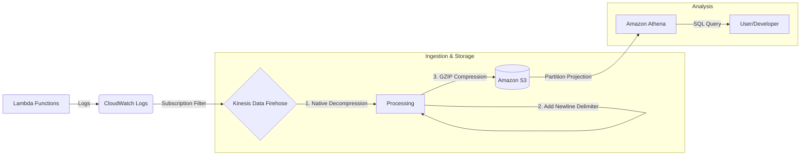

# 🚀 LogStreaming: Serverless Log Aggregation & Analytics

A production-grade, cost-optimized pipeline to stream AWS CloudWatch logs to S3 for SQL-based analysis in Amazon Athena. This project is built using the Serverless Framework and utilizes native AWS features to avoid custom Lambda processing costs.

---

## 📊 Data Flow Architecture



---

## 🛠️ Key Features

*   **Zero-Lambda Processing:** Uses native Kinesis Firehose features (Decompression & Delimiting) to prepare logs for Athena, saving on execution costs.
*   **High Performance:** Optimized with **GZIP compression** and **Athena Partition Projection** for lightning-fast, low-cost SQL queries.
*   **Automated Wiring:** The `serverless-plugin-log-subscription` automatically connects every Lambda function to the pipeline upon deployment.
*   **Hive-Style Partitioning:** Automatically organizes data in S3 by `year/month/day/hour`.

---

## 🚀 Workflow & Usage

### 1. Deployment
Deploy the infrastructure and the demo Lambda functions:
```bash
npm install
sls deploy --stage dev
```

### 2. Generate Logs
Invoke the demo functions to send data into the pipeline:
```bash
# Invoke via AWS CLI or Console
aws lambda invoke --function-name logstreaming-dev-demo_one /dev/null
```

### 3. Setup Athena
Create the analytics table and view using the scripts in the [Athena Guide](ATHENA_GUIDE.md):
1.  Run the **Table DDL** to enable Partition Projection.
2.  Run the **View DDL** to flatten the JSON records.

### 4. Query Logs
Run SQL queries to analyze your logs in real-time:
```sql
SELECT logGroup, event_time, message 
FROM cloudwatch_logs_flattened 
WHERE year = '2026' AND month = '02' 
ORDER BY event_time DESC 
LIMIT 50;
```

---

## 📖 Documentation
*   [**Implementation Guide**](DOCS_IMPLEMENTATION.md): Deep dive into the architecture and configuration.
*   [**Athena Guide**](ATHENA_GUIDE.md): Complete DDL and example SQL queries.
*   [**Project Retrospective**](PROJECT_RETROSPECTIVE.md): Lessons learned and troubleshooting history.

---

## ⚖️ License
ISC License. See `package.json` for details.
