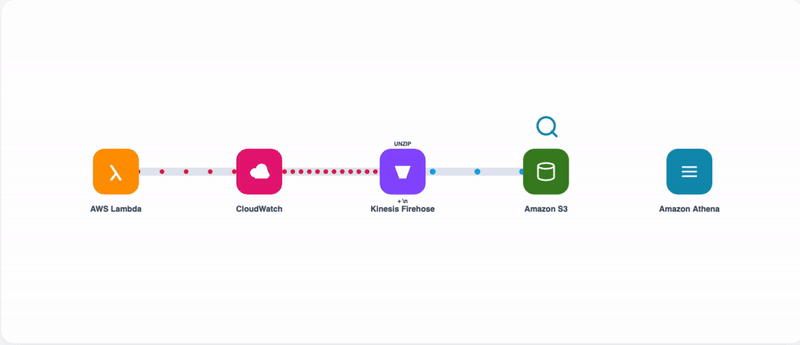
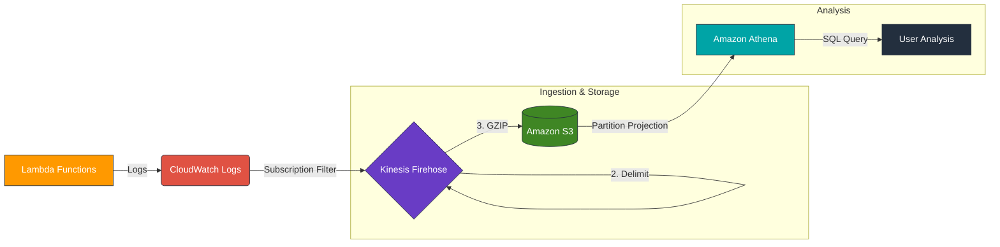

# 🚀 LogStreaming: Serverless Log Aggregation & Analytics

A cost-optimized pipeline to stream AWS CloudWatch logs to S3 for SQL-based analysis in Amazon Athena. Built using the Serverless Framework with native AWS features to avoid custom Lambda processing costs.




---

## 📊 Data Flow Architecture

[](https://Hemanth-Py.github.io/logstreaming/)


```mermaid
graph LR
    %% Styles
    classDef lambda fill:#FF9900,stroke:#232F3E,color:white;
    classDef cw fill:#E05243,stroke:#232F3E,color:white;
    classDef firehose fill:#693CC5,stroke:#232F3E,color:white;
    classDef s3 fill:#3F8624,stroke:#232F3E,color:white;
    classDef athena fill:#00A4A6,stroke:#232F3E,color:white;
    classDef user fill:#232F3E,stroke:#232F3E,color:white;

    %% Nodes
    A[Lambda Functions]:::lambda -->|Logs| B(CloudWatch Logs):::cw
    B -->|Subscription Filter| C{Kinesis Firehose}:::firehose
    C -->|1. Decompress| C
    C -->|2. Delimit| C
    C -->|3. GZIP| D[(Amazon S3)]:::s3
    D -->|Partition Projection| E[Amazon Athena]:::athena
    E -->|SQL Query| F[User Analysis]:::user

    subgraph "Ingestion & Storage"
    C
    D
    end

    subgraph "Analysis"
    E
    F
    end
```

## 🧠 How It Works (The "Secret Sauce")

This pipeline solves the common "Concatenated JSON" problem without writing a single line of custom code.

1.  **Ingestion:** Lambda functions output logs. CloudWatch automatically compresses them into **GZIP** blobs.
2.  **Firehose Processing:**
    *   **Decompression:** Firehose natively "unzips" the incoming GZIP blob into raw text.
    *   **Delimiting:** A specific processor appends a `\n` (newline) character to every record.
    *   **Re-compression:** The clean, newline-separated JSON is Gzipped again for efficient storage.
3.  **Athena Analysis:** Because every record is on its own line (`\n`), Athena's JSON parser can read millions of logs in seconds without getting stuck on the first line.

---

## 🛠️ Key Features

*   **Zero-Lambda Processing:** Uses native Kinesis Firehose features (Decompression & Delimiting) to prepare logs for Athena, saving on execution costs.
*   **High Performance:** Optimized with **GZIP compression** and **Athena Partition Projection** for lightning-fast, low-cost SQL queries.
*   **Automated Wiring:** The `serverless-plugin-log-subscription` automatically connects every Lambda function to the pipeline upon deployment.
*   **Hive-Style Partitioning:** Automatically organizes data in S3 by `year/month/day/hour`.

---

## 🚀 Workflow & Usage

### 1. Deployment
Deploy the infrastructure and the demo Lambda functions:
```bash
npm install
sls deploy --stage dev
```

### 2. Generate Logs
Invoke the demo functions to send data into the pipeline:
```bash
# Invoke via AWS CLI or Console
aws lambda invoke --function-name logstreaming-dev-demo_one /dev/null
```

### 3. Setup Athena
Create the analytics table and view using the scripts in the [Athena Guide](ATHENA_GUIDE.md):
1.  Run the **Table DDL** to enable Partition Projection.
2.  Run the **View DDL** to flatten the JSON records.

### 4. Query Logs
Run SQL queries to analyze your logs in real-time:
```sql
SELECT logGroup, event_time, message 
FROM cloudwatch_logs_flattened 
WHERE year = '2026' AND month = '02' 
ORDER BY event_time DESC 
LIMIT 50;
```

---

## 📖 Documentation
*   [**Implementation Guide**](DOCS_IMPLEMENTATION.md): Deep dive into the architecture and configuration.
*   [**Athena Guide**](ATHENA_GUIDE.md): Complete DDL and example SQL queries.
*   [**Project Retrospective**](PROJECT_RETROSPECTIVE.md): Lessons learned and troubleshooting history.

---

## ⚖️ License
ISC License. See `package.json` for details.
